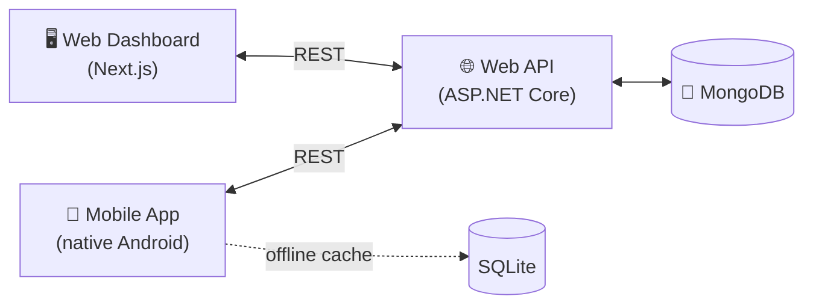

<p align="center">
  
</p>

<h3 align="center">Smart Solar Microgrid Trading System</h3>

<p align="center">
  An end-to-end platform for reserving and trading energy at solar microgrid charging nodes.
</p>

---

## Overview

SolarSync connects three kinds of users around a network of solar microgrid nodes:

- **Solar prosumers** — property owners with solar arrays who reserve energy drop-off/charging slots and trade stored power.
- **Grid operators** — field staff who manage node availability and finalize energy transfers on-site.
- **Backoffice staff** — administrators who manage users, prosumer accounts, and microgrid infrastructure.

The system follows a **thin-client / FAT-service architecture**: a central Web API owns all business logic and is the only component with database access, while the web dashboard and mobile app are pure UI layers that talk to it exclusively over REST.



## Functionality

- **Prosumer lifecycle** — mobile self-registration with Backoffice/Grid Operator approval, profile management, and deactivation, all keyed by National Identity Card (NIC).
- **Microgrid node management** — register nodes with GPS location, capacity, and battery slots; update schedules; deactivate nodes (blocked while active reservations exist).
- **Energy slot reservations** — prosumers book, modify, or cancel charging/trading slots (within 7 days, 12-hour change notice), with dashboard visibility for staff and operators.
- **QR-verified energy transfer** — approved reservations generate a secure, server-verified transaction QR code that a Grid Operator scans in the mobile app to finalize the transfer.
- **Role-based access & auth** — JWT-based authentication for staff (Backoffice / Grid Operator) and prosumers, with invitation-based onboarding and refresh-token session handling.
- **Dashboards & maps** — operational insights on the web dashboard, and nearby-node discovery with booking history on mobile.
- **Offline-friendly mobile client** — local SQLite persistence with a background sync outbox so registration and approvals keep working without connectivity.

## Tech Stack

| Layer | Stack |
|---|---|
| **Web API** | ASP.NET Core (.NET 10) Web API, MongoDB.Driver, JWT bearer auth, MailKit |
| **Web Dashboard** | Next.js 16 / React 19, TypeScript, Tailwind CSS, shadcn/ui, TanStack Query, React Hook Form + Zod, Recharts, Leaflet |
| **Mobile App** | Native Android (Kotlin), SQLite, OkHttp, WorkManager, Google Maps SDK |
| **Database** | MongoDB (NoSQL) |
| **Deployment target** | Windows IIS (Web API) |

## Repository Structure

```
smart-solar-mgt-api/       ASP.NET Core Web API — all business logic and data access
smart-solar-mgt-fe/        Next.js web dashboard for Backoffice/Grid Operator staff
smart-solar-mobile-app/    Native Android app for prosumers and Grid Operators
project-specification.md   Source-of-truth functional/architectural spec
```

Each subproject has its own `README.md`/`CLAUDE.md` with setup instructions and implementation notes.
