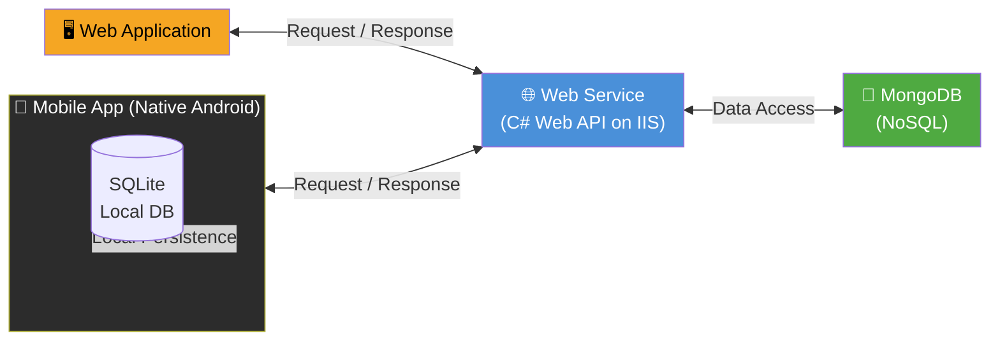

# Smart Solar Microgrid Trading System

## Project Specification Document

---

## 1. Overview

The purpose of this project is to create an end-to-end **Smart Solar Microgrid Trading System** using a client-server architecture. The system features a **web application** for back-office administration and microgrid site operators, alongside a **mobile application** for solar prosumers (property owners with solar panel arrays).

The system consists of three major components:

- **Web Application** — administration and operations interface
- **Mobile Application** — prosumer and grid operator interface (native Android)
- **Web Service** — centralized API and business logic layer

---

## 2. High-Level System Architecture

Both client applications (Web and Mobile) communicate **exclusively** via RESTful API calls to a central **Web Service**. The service holds all business logic (FAT Service pattern) and is the only component that communicates with the NoSQL database (MongoDB). Each client also maintains its own local persistence layer for UI-level/offline needs.

**Key architectural principles:**

- The Web Application and the Mobile Application are limited to **user interface functionality only**.
- All business logic resides strictly within the central **Web Service**.
- Both clients communicate with the service **exclusively via RESTful API calls**.
- The **NoSQL (MongoDB)** database is accessed only by the Web Service — never directly by the clients.
- Local persistence (SQLite) on Android is used only where explicitly specified (e.g., local user data caching), not as a replacement for server-side logic.

---

## 3. Web Application

### 3.1 User Management
- Create web application users with two distinct roles: **Backoffice** and **Grid Operator**.
- Only **Backoffice** users have access to system administration functions.
- **Grid Operators** access operational tools only.

### 3.2 Prosumer Management
- Create, update, and deactivate prosumer profiles using **National Identity Card (NIC)** as the primary key.
- Deactivated accounts can only be **reactivated by a Backoffice officer**.

### 3.3 Microgrid Node Management
- Manage solar grid hubs, including:
  - Creating new hubs with **GPS location**, **capacity specs (kW/h)**, and **available battery storage slots**.
  - Updating schedules.
  - Deactivating nodes — deactivation is **blocked if active energy reservations exist**.

### 3.4 Energy Slot Reservation Management
- Create, update, and cancel power trading reservations.
- Reservations must be scheduled **within 7 days**.
- Updates and cancellations require **at least 12 hours' notice**.

### 3.5 User Interface
- Developed using **Bootstrap 5**, **Tailwind CSS**, or **React.js** for a responsive appearance.

---

## 4. Mobile Application

> **Native Specs:** Mobile apps must be **pure native Android** with a local **SQLite** database for local user management. **No cross-platform frameworks are allowed.**

Mobile applications provide functionality for both **Solar Prosumers** and **Grid Operators**.

### 4.1 Prosumer Account Control
- Prosumers register using **NIC** as the primary key.
- Edit profile data.
- Request account deactivation.

### 4.2 Reservation & QR Dispatch
- Prosumers reserve, modify, or cancel energy drop-off/charging slots.
- Once approved, the app generates a **secure transaction QR code**.

### 4.3 Dashboard & Maps
- Display active/pending reservation counts and bookings.
- Show nearby grid nodes via the **Google Maps API**.
- Users can view booking history, pending bookings, and search bookings.

### 4.4 Operator Mode
- Grid Operators log into the mobile app.
- Scan the prosumer's transaction QR code.
- Verify server data and finalize energy transfer business logic.

---

## 5. Web Service

### 5.1 Architecture
- **FAT Service pattern** — all business logic resides strictly in the central API.

### 5.2 Tech Stack
- **C# Web API** deployed on a **Windows IIS Server**.
- **NoSQL** server-side database (e.g., **MongoDB**).

### 5.3 Client Constraints
- Both Web and Pure Android clients act purely as **UI interfaces**.
- Local persistence is maintained only where specified (**SQLite on Android**).
- Clients communicate **exclusively via RESTful API calls** to the central service.

---

## 6. Project Scenario

- The **Backoffice** team is responsible for managing the registration of solar microgrid nodes and maintaining their operational schedules.
- **Grid Operators**, who can access both the web application and the mobile application, are responsible for updating battery slot availability and monitoring power trading bookings.
- **Solar Prosumers** use the mobile application to reserve energy slots, modify existing reservations, and review their energy transfer history.
- Once a booking is confirmed, the prosumer receives a confirmation and can access the details directly on their dashboard.
- If circumstances change, cancellations can be made either through the mobile application or with the assistance of a grid operator.
